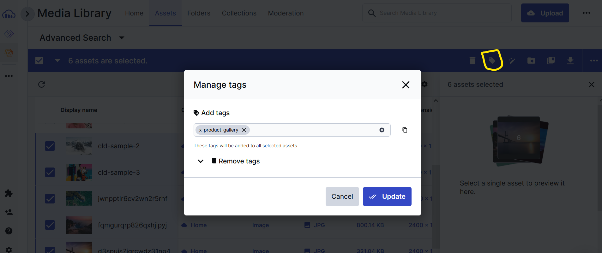

# Solid Cloudinary Product Gallery Widget

You can use the Product Gallery widget to display an image gallery in your
application.

View Demo: [COLBY DEPLOY THIS ON NETLIFY PLS]

## 🧰 Using ProductGallery in a Solid project

1. To use the ProductGallery widget in a Solid.js app, first load its script:

```
<script src="https://product-gallery.cloudinary.com/all.js" type="text/javascript">
</script>
```

This will add a `cloudinary` property to the `window` object which will contain
a `productWidget` method that you can use to initialize the widget.

2. In `App.jsx`, we are getting images containing the tags "solid-product-gallery" and videos containing the tags "solid-product-gallery-vids". 
Make sure to add these tags to your images and videos in the cloudinary console.



Alternatively, you can change the tag names in `App.jsx` to match what the images and videos are tagged in your cloudinary console. Maybe have a dropdown to show the list of tags and show the dynamic gallery based on selection.

## 🚀 Get Started with This Example

- Create an environment variable file `.env` or copy/rename `sample.env` and inside add:

```
VITE_CLOUDINARY_CLOUD_NAME="<Your Cloud Name>"
```

(Also ensure you have unticked "Resource List" from Restricted media types in [Settings > Security](https://console.cloudinary.com/settings/security))

- Install the project dependencies with:

```
yarn install
# or
npm install
```

- Start the development server with:

```
yarn dev
# or
npm run dev
```

- Visit the project at <http://127.0.0.1:5173/>!